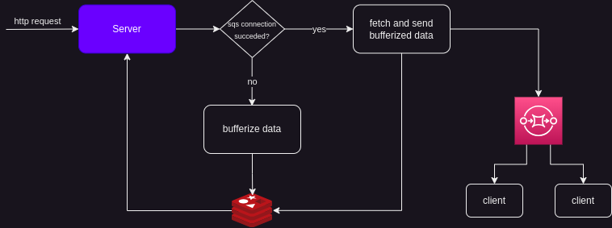

# publisher

The overall idea of the project is to develop some studies on data streaming using
sqs and redis in order to provide data to clients as fast as possible. The overall architecture is better
described in the image below:

